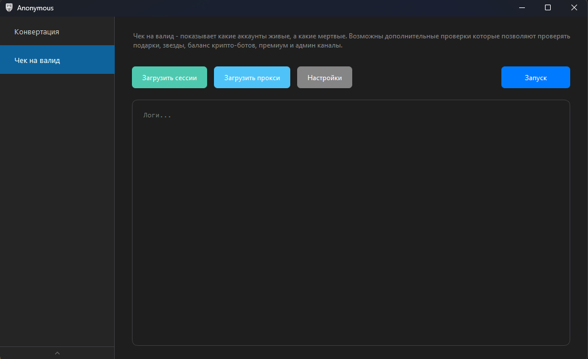
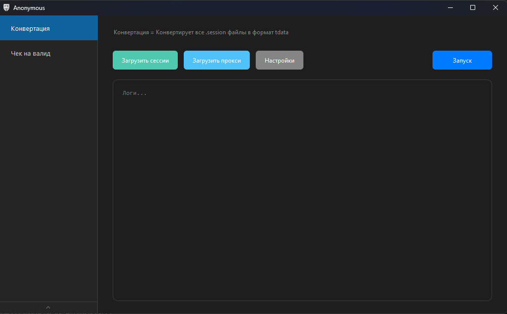

# ANONYMOUS-CHECKER

Десктопный инструмент на `PyQt6` для:
- проверки Telegram-сессий на валидность;
- конвертации `.session` в `tdata`;
- конвертации `tdata` в `.session`.

## Возможности

### Checker (Чек на валид)
- Проверка `telethon` / `pyrogram` сессий на валидность
- Массовая загрузка сессий
- Дополнительные проверки (включаются в настройках по необходимости):
  - Premium
  - Stars
  - NFT/подарки
  - Админ-каналы
- Работа с прокси и без прокси

### Converter (Конвертация)
- Конвертация `.session` -> `tdata`
- Конвертация `tdata` -> `.session`
- Массовая обработка сессий
- Поддержка прокси и режима без прокси

## Скриншоты

### Чек на валид


### Конвертация


## Технологии

- Python 3.13
- PyQt6
- Telethon
- Pyrogram
- opentele-py313

## Установка

```bash
python -m venv .venv
.venv\Scripts\activate
pip install -r requirements.txt
```

## Запуск

```bash
python main.py
```

## Структура проекта

```text
main.py
src/
  core/      # checker / converter логика
  ui/        # окна, диалоги, view-компоненты
  utils/     # тема, конфиг, прокси-утилиты
assets/      # иконки и скриншоты
```
